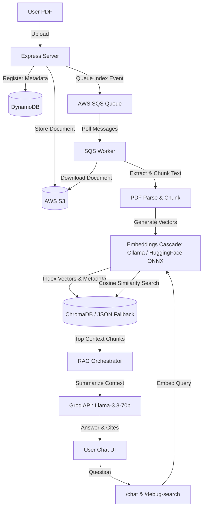

# AI Notebook App — Cloud RAG & PDF Indexing Pipeline

A production-grade, cloud-native **RAG (Retrieval-Augmented Generation)** educational assistant. Users can upload study notebooks (PDFs) to AWS S3, register index metadata in DynamoDB, chunk and index text into a semantic vector store, and chat with their documents using Groq's high-throughput LLM models.

---

## 🚀 Key Features

* **JWT-Based Authentication**: Secure sign-up, login, and token-based protection for chat/file endpoints.
* **Document Ingestion Pipeline**:
  - Direct PDF uploads to **AWS S3** bucket storage.
  - Tracking metadata (hash, filename, upload folder, owner ID) in **Amazon DynamoDB**.
* **Self-Healing Semantic Embedding Cascade**:
  - Generates dense vector representations using local **Ollama** (`nomic-embed-text`).
  - Automatically falls back to local **HuggingFace ONNX** sentence-transformers (`all-MiniLM-L6-v2` running natively in Node.js on CPU) if Ollama is offline.
  - Zero reliance on mock, fake, or deterministic embeddings.
* **Local Vector Database Fallback**:
  - If ChromaDB is unreachable, the system falls back to a local JSON-based vector store (`chroma_fallback.json`).
  - Computes exact **Cosine Similarity** rankings (`1 - distance`) natively in Javascript.
* **Smart RAG Prompt Engine**:
  - Automatically queries the top 10 matching document chunks.
  - Submits prompts to **Groq** using the state-of-the-art `llama-3.3-70b-versatile` model.
  - Prioritizes notes context but cleanly falls back to general knowledge for general greetings ("hello") and questions outside the document scope.
* **RAG Debugging Endpoint**:
  - `POST /debug-search` returns the exact text chunks matched against a query alongside their calculated similarity score.
* **CI/CD EC2 Deployment**:
  - Automated deployment workflow via GitHub Actions pushing to AWS EC2 using **PM2** process management.

---

## 🛠️ Technology Stack

* **Runtime**: Node.js (CommonJS modules)
* **Web Framework**: Express
* **Database**: Amazon DynamoDB, ChromaDB (with local JSON fallback)
* **Storage**: Amazon S3
* **Queue**: Amazon SQS (Background workers)
* **LLM API**: Groq (via `openai` SDK)
* **Embeddings**: Ollama / HuggingFace Transformers ONNX
* **Styling & UI**: Vanilla CSS with glassmorphic dark-theme layouts

---

## 📁 System Architecture



---

## 🔑 Environment Variables (`.env`)

Create a `.env` file in the root directory:

```env
# AWS Configuration
AWS_ID=your_aws_access_key_id
AWS_SECRET_KEY=your_aws_secret_access_key
AWS_REGION=us-east-1
AWS_BUCKET_NAME=your_s3_bucket_name

# SQS Queue
SQS_QUEUE_URL=https://sqs.us-east-1.amazonaws.com/your_account_id/pdf-indexing-queue

# LLM API
GROQ_API_KEY=gsk_your_groq_api_key

# Database
CHROMA_URL=http://localhost:8000
JWT_SECRET=your_jwt_signature_secret_key
PORT=3000
```

## 🔑 Test Credentials

For testing and evaluation:
* **User ID**: `user123`
* **Password**: `user123`

---

## 💻 Running Locally

### Prerequisites
* Node.js (v18+)
* (Optional) Ollama running locally with `nomic-embed-text` (`ollama run nomic-embed-text`)

### Installation
1. Clone the repository and install dependencies:
   ```bash
   npm install
   ```

2. Start the Express API server:
   ```bash
   npm start
   ```
   *Note: On server startup, the S3 synchronizer will automatically scan S3 and index any missing documents into the fallback database using local sentence-transformers.*

3. Start the SQS indexing worker (requires SQS credentials):
   ```bash
   node worker.js
   ```

---

## 📡 API Reference

### Authentication
* **`POST /register`**: Register a new user (`userId`, `password`).
* **`POST /login`**: Logs in user and returns JWT token (`userId`, `password`).

### Documents
* **`POST /upload`**: Uploads a PDF to S3. Form data expects `file` and `folder` (protected).
* **`GET /files`**: List all uploaded files (protected).
* **`GET /folders`**: List all folders (protected).

### RAG Chat & Debugging
* **`POST /chat`**: Coordinates vector retrieval and Groq summary (protected).
  - Body: `{"question": "What is Docker?", "scope": "all"}`
  - Scope: `"all"` (search all documents) or `"mine"` (search only current user's uploads).
* **`POST /debug-search`**: Returns matching chunks and similarity scores without running LLM synthesis (protected).
   - Body: `{"question": "What is deadlock?"}`

Visit the application at http://54.172.16.31:3000/
